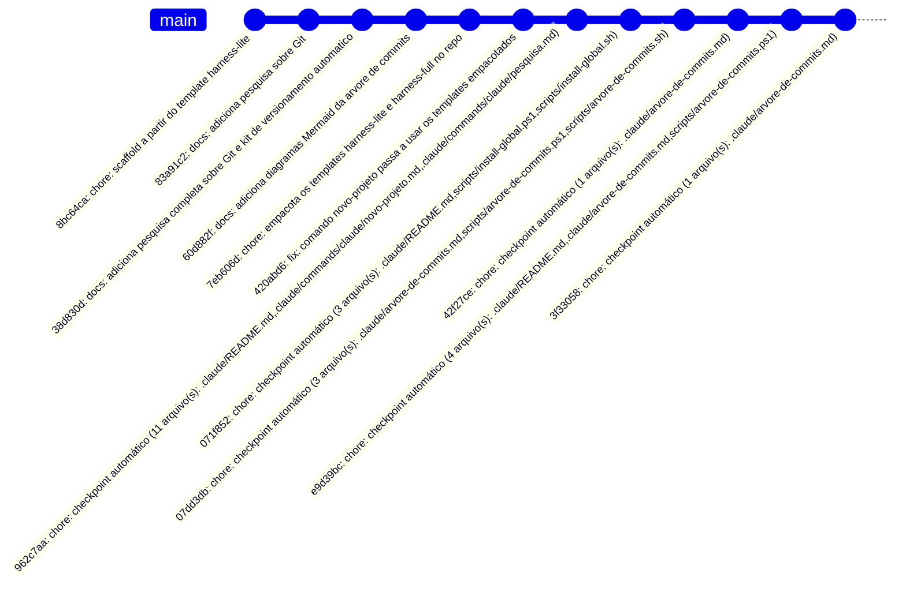

# Árvore de commits

> Gerado automaticamente a partir do histórico real do repositório — não editar à mão.
> Atualizado em: 2026-07-16 15:27:06



<details><summary>Log bruto (git log --graph)</summary>

```
* 3f33058 2026-07-16 chore: checkpoint automático (1 arquivo(s): .claude/arvore-de-commits.md) (HEAD -> main)
* e9d39bc 2026-07-16 chore: checkpoint automático (4 arquivo(s): .claude/README.md,.claude/arvore-de-commits.md,scripts/arvore-de-commits.ps1)
* 42f27ce 2026-07-16 chore: checkpoint automático (1 arquivo(s): .claude/arvore-de-commits.md)
* 07dd3db 2026-07-16 chore: checkpoint automático (3 arquivo(s): .claude/arvore-de-commits.md,scripts/arvore-de-commits.ps1,scripts/arvore-de-commits.sh)
* 071f852 2026-07-16 chore: checkpoint automático (3 arquivo(s): .claude/README.md,scripts/install-global.ps1,scripts/install-global.sh)
* 962c7aa 2026-07-16 chore: checkpoint automático (11 arquivo(s): .claude/README.md,.claude/commands/claude/novo-projeto.md,.claude/commands/claude/pesquisa.md)
* 420abd6 2026-07-16 fix: comando novo-projeto passa a usar os templates empacotados
* 7eb606d 2026-07-16 chore: empacota os templates harness-lite e harness-full no repo
* 60d882f 2026-07-16 docs: adiciona diagramas Mermaid da arvore de commits
* 38d830d 2026-07-16 docs: adiciona pesquisa completa sobre Git e kit de versionamento automatico (origin/main)
* 83a91c2 2026-07-16 docs: adiciona pesquisa sobre Git
* 8bc64ca 2026-07-16 chore: scaffold a partir do template harness-lite
```

</details>
