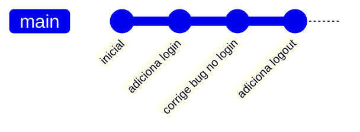
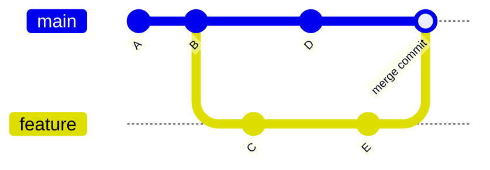
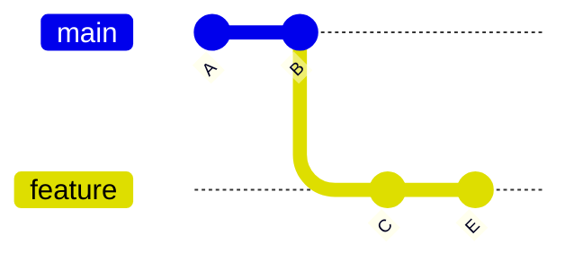
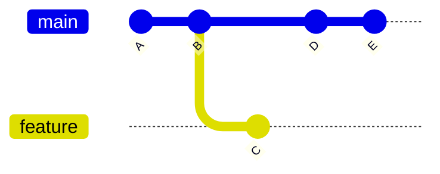
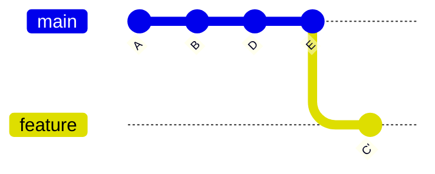
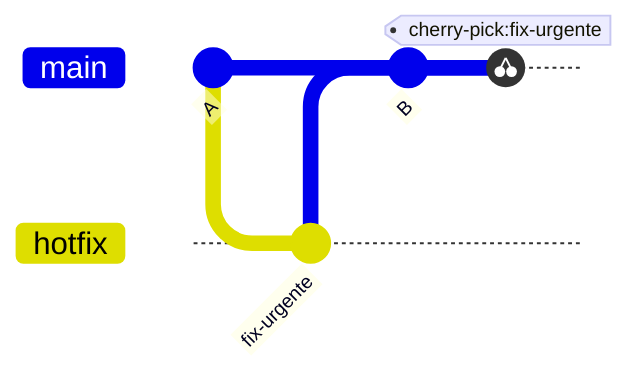
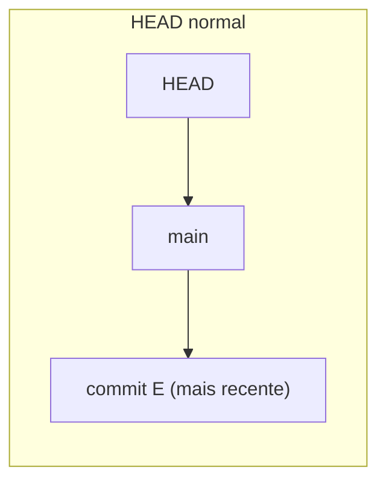
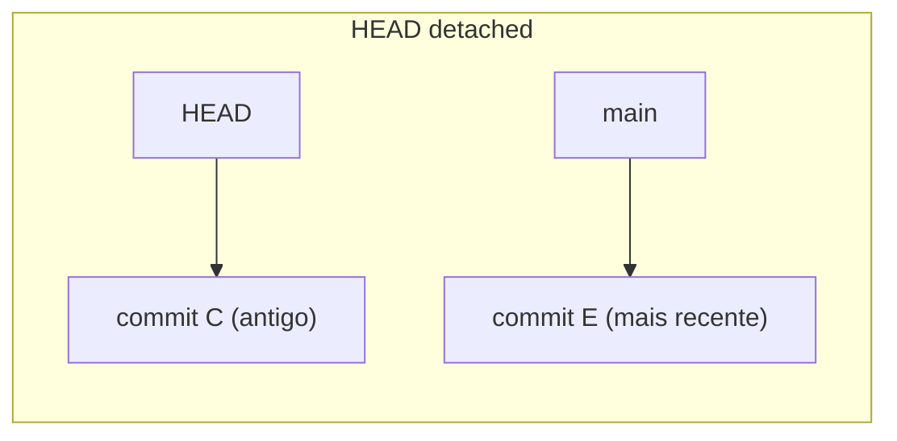

# A árvore de commits — diagramas

Complemento visual de [06-branching-e-merge.md](06-branching-e-merge.md):
os mesmos conceitos (branch, merge, rebase, cherry-pick, HEAD), mas em
diagramas em vez de só prosa. Renderizados automaticamente pelo GitHub
(sintaxe [Mermaid](https://mermaid.js.org/)).

## Histórico linear

O caso mais simples: cada commit tem um único pai, a branch `main` é só um
ponteiro que avança a cada novo commit.

## Branch nova + merge

Criar uma branch (`git switch -c feature`) não copia nada — é só um novo
ponteiro apontando para o commit atual. Os dois ponteiros (`main` e
`feature`) então avançam de forma independente conforme cada um recebe
commits.

Esse é o caso de **merge commit** (three-way merge): as duas branches
avançaram separadamente (`main` ganhou `D`, `feature` ganhou `C` e `E`), e
o Git precisa de um commit novo com **dois pais** para juntar as duas
histórias.

### Caso especial: fast-forward

Se `main` **não** tivesse avançado (sem o commit `D` acima), o merge não
geraria commit novo nenhum — o Git só moveria o ponteiro `main` direto para
`E`. O Mermaid sempre desenha um commit de merge, mas na prática, nesse
cenário, o histórico ficaria simplesmente:

...e depois do fast-forward, `main` passa a apontar para o mesmo commit
`E` que `feature` — sem ramificação nenhuma no grafo. Use
`git merge --no-ff` se quiser **forçar** um commit de merge mesmo quando o
fast-forward seria possível (útil para deixar visível no histórico que uma
feature foi desenvolvida à parte).

## Rebase — antes e depois

Rebase **reescreve** os commits da branch atual como se tivessem sido
criados em cima de outro ponto. Os commits reaplicados ganham **hashes
novos** (por isso `C` vira `C'` abaixo).

**Antes** (`feature` diverge de `main` no commit `B`):

**Depois de `git rebase main` (estando em `feature`):**

Note que o histórico fica **linear** — sem commit de merge — mas o preço é
que `C` deixou de existir e virou `C'`, um commit diferente. É por isso que
rebase é seguro em branches locais/não publicadas, e arriscado em branches
que outras pessoas já basearam trabalho em cima (elas ainda têm o `C`
antigo, não o `C'` novo).

## Cherry-pick

Aplica um commit específico de uma branch em outra, sem trazer o resto do
histórico dela:

O commit `fix-urgente` aparece em `main` com um hash novo — é uma cópia do
conteúdo, não o mesmo objeto commit.

## HEAD: normal vs. detached

`HEAD` normalmente aponta para uma branch, que por sua vez aponta para um
commit ("HEAD simbólico"). Ao dar checkout direto num commit específico
(em vez de numa branch), `HEAD` passa a apontar **direto** para aquele
commit — estado chamado de *detached HEAD*.

Commits novos feitos em detached HEAD **não pertencem a nenhuma branch** —
se você trocar de branch sem criar uma nova referência para eles antes
(`git switch -c nome-novo`), eles ficam sem um ponteiro apontando para
si e podem parecer "perdidos" (embora o `git reflog` normalmente ainda
permita recuperá-los — ver [comandos avançados](05-comandos-avancados.md)).

## Resumo visual: o que cada comando faz ao grafo

| Comando | Efeito no grafo |
|---|---|
| `git commit` | Adiciona um nó, avança o ponteiro da branch atual |
| `git switch -c nome` | Cria um ponteiro novo, apontando para o commit atual |
| `git merge branch` | Cria um nó com dois pais (ou só avança o ponteiro, se for fast-forward) |
| `git rebase branch` | Recria os commits da branch atual em cima de outro ponto — hashes novos |
| `git cherry-pick hash` | Copia o conteúdo de um commit específico para o topo da branch atual — hash novo |
| `git reset --hard hash` | Move o ponteiro da branch atual direto para outro commit já existente |
